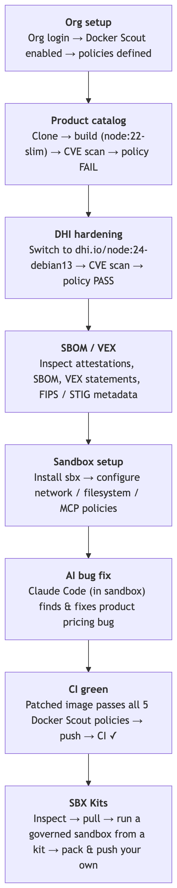

# DHI & AI Governance: Secure Supply Chain to Sandbox

## What we're covering

This lab walks through the complete Docker security story — from trusted base images through to AI agent governance. By the end you'll have seen how Docker Hub Integration (DHI), Docker Scout, and Docker Sandboxes work together to enforce policy at every layer of the development lifecycle.

---

## The problem space

Modern software development has two intersecting governance challenges:

**Supply chain risk**

Every container image you build starts with a base image. That base image carries packages, libraries, and an OS — each with its own CVE surface. Most teams have no automated gate between "we discovered a critical CVE" and "that CVE ships to production."

**AI agent risk**

AI coding agents can read, write, and execute — and they do it fast. Without guardrails, an agent running inside a developer's environment can exfiltrate source code, make network calls to arbitrary domains, or install malicious packages. The blast radius of a compromised or misbehaving agent is the full host filesystem and network.

---

## The Docker answer

| Challenge | Docker solution |
|---|---|
| Unvetted base images | **DHI** — Docker Hub Integration serves FIPS-validated, STIG-hardened images via `dhi.io` |
| No CVE gating in CI | **Docker Scout** — policy checks block the pipeline if images fail |
| Missing SBOM / provenance | **Scout attestations** — SBOM + SLSA provenance attached at build time |
| AI agents without boundaries | **Docker Sandboxes** — microVM isolation, network/filesystem/MCP policies, credential proxy, audit log |

---

## Lab flow

---

> **Everything in the terminal is simulated.**  
> Click **Run** on any code block to send the command to the simulated terminal.

> **Demo reset**: at any point, type `demo reset` in either terminal to wipe all lab state and start fresh from Section 2.

[Continue to Section 2 → Org Setup & Scout Policies](#/2-org-setup-scout-policies)
