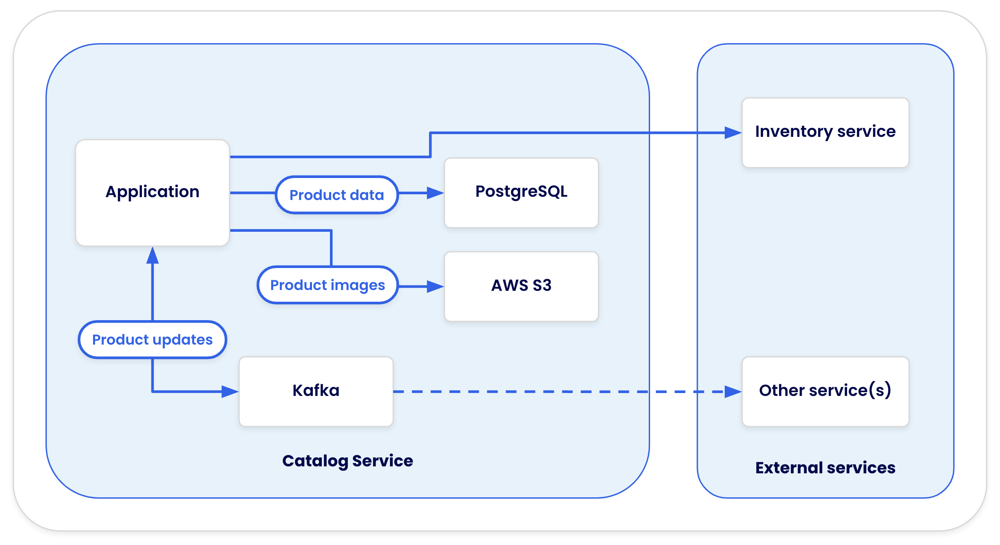

# DHI — Product Catalog Service

The workload is [`catalog-service-node`](https://github.com/dockersamples/catalog-service-node) — a Node.js REST API backed by PostgreSQL, S3 (LocalStack), Kafka, and WireMock.

## Application architecture



### Develpment Architecture

~

---

## Step 1 : Inspect the current Dockerfile

```bash
cat Dockerfile
```

> The base image is `node:22-alpine` — a community image with no SBOM, no provenance, and no signature.

---

## Step 2 : Scout CVEs on the community image

```bash
docker scout cves node:22-alpine --org $$org$$
```

> The output shows **2 CRITICAL** fixable CVEs in `braces` and `axios` — both direct or transitive npm dependencies. Policy: **FAILED**.

---

## Step 3 : Push with the community image — CI fails

```bash
git add Dockerfile
```

```bash
git commit -m "initial commit"
```

```bash
git push
```

Now view the CI pipeline run — GitHub Actions-style, job by job:

```bash
gh run view
```

> The `policy-gate` job fails — `push` and `deploy` are skipped.
> Switch to the **CI Pipeline tab** (top right) to see the same run rendered visually.


---

## Step 4 : The fix: one line in the Dockerfile

All Docker Hardened Images follow the format **`<org>/dhi-<name>:<tag>`**.

> **Before:** `FROM node:22-alpine`
>
> **After:** `FROM $$org$$/dhi-node:22`

``` bash
cat newDockerfile
```

The  dhi-node:22 image is:
- Distroless — no shell, no package manager at runtime
- 0 CRITICAL / 0 HIGH CVEs
- FIPS 140-2 validated cryptography, STIG v1R4 compliant
- SBOM, provenance, and cosign signature attached at build

---

## Step 5 : Scout CVEs on the DHI image

```bash
docker scout cves $$org$$/dhi-node:22 --org $$org$$
```

> All CVEs resolved. Policy: **PASSED**. Same CLI, same policy set — the base image is the only change.

---

## Step 6 : Inspect SBOM and attestations

```bash
docker scout sbom $$org$$/dhi-node:22 --format list
```

```bash
docker scout attestation inspect $$org$$/dhi-node:22
```

```bash
docker scout vex inspect $$org$$/dhi-node:22
```

> The VEX statement explains why the one MEDIUM CVE is suppressed: the vulnerable code path is unreachable in this distroless configuration.

---

## Step 7 : Scout policy gate: community fails, DHI passes

Run the policy check directly to see the contrast:

```bash
docker scout policy node:22-alpine --org $$org$$ --exit-code
```

Then check the DHI image:

```bash
docker scout policy $$org$$/dhi-node:22 --org $$org$$ --exit-code
```

---

## Step 8 : Push again with DHI — CI passes

Update the Dockerfile (Claude does this automatically in Section 03, but you can do it manually here):

```bash
git add Dockerfile
```

```bash
git commit -m "switch to DHI node:22"
```

```bash
git push
```

View the pipeline again:

```bash
gh run view
```

> All four jobs go green: **Build ✔ → Policy Gate ✔ → Push ✔ → Deploy ✔**
> The CI Pipeline tab also updates to show the passing run.