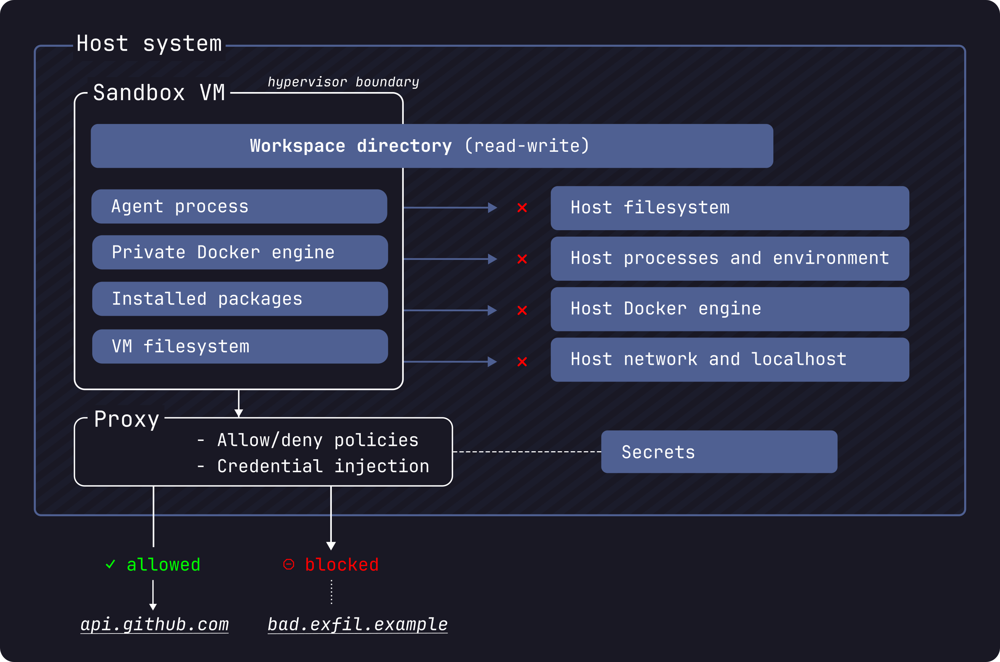

# Sandbox & AI Governance

Docker Sandboxes run AI coding agents inside isolated microVMs. Each sandbox has its own daemon, filesystem, and network — governed by a declarative policy set.

## Sandbox security model


**Reference:** [docs.docker.com/ai/sandboxes/security](https://docs.docker.com/ai/sandboxes/security/)

---

## Why sandbox an AI agent?

- **Blast radius control** — the agent can't access host credentials or filesystem paths outside `/workspace`, even if explicitly prompted to try.
- **Network allowlist** — outbound traffic is explicitly permitted. No exfiltration to unknown endpoints.
- **Full audit trail** — every `Read()`, `Edit()`, and `Bash()` call is logged with timestamps. You see exactly what the agent did and in what order.

---

## Step 1 — Review local sandbox policies

```bash
sbx policy show --context local
```

Three policy dimensions: **Network**, **Filesystem**, **MCP**.

---

## Step 2 — Start the sandbox

Mount the catalog service workspace and start Claude Code inside the microVM.

```bash
sbx run --agent claude --mount ~/catalog-service-node:/workspace
```

---

## Step 3 — Check running sandboxes

```bash
sbx ps
```

---

## Step 4 — Ask Claude to fix the missing product item code

The bug: `GET /products/:id` never extracts `req.params.id` before passing it to `pool.query()`. The product item code is missing — the query always runs without an id.

```bash
claude -p "Find the bug in the product lookup route and fix it. The item code is missing."
```

> **Reading the Claude Code output:**
> - `✦` lines are Claude's reasoning (thinking)
> - `● Read(file)` / `● Edit(file)` are tool calls with file paths
> - `⎿  Read N lines` / `⎿  Applied edit` are tool results
> - The diff shows exactly what was changed
> - The final `✔ Done` line shows tool count, cost, and duration

---

## Step 5 — View audit logs

Every tool call Claude made is captured in the sandbox log.

```bash
sbx logs sandbox-b9f3e1a2
```

> The log shows `Read`, `Read`, `Edit` in sequence — no network calls, no filesystem access outside `/workspace`. Fully audited.