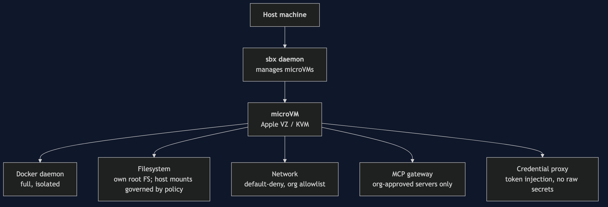
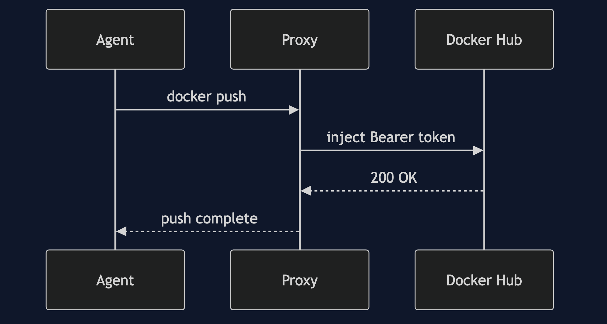

# Section 4 — Sandboxes and AI Governance

## What is a Docker Sandbox?

> Isolated microVM environments that let AI coding agents build, run, and iterate — without touching the host system.

**In 20 words:** Docker Sandboxes give AI agents a fully isolated microVM with its own Docker daemon, filesystem, network, and org-level policy enforcement.

### Five reasons to run AI agents in a sandbox

1. **Filesystem isolation** — the microVM has its own root filesystem, separate from the host; filesystem *policy* additionally governs which host paths (e.g. your SSH keys) can be mounted into the sandbox workspace in the first place.
2. **Network governance** — outbound traffic is blocked by default; admins define an allowlist of domains the agent may reach per org.
3. **MCP control** — only MCP servers explicitly approved in your Docker Hub org are available inside the sandbox; rogue tool servers can't be injected.
4. **Credential proxy** — Docker Hub and GitHub tokens are injected transparently at the network layer; the agent never sees raw credentials.
5. **Audit log** — every tool call, file read, network attempt, and MCP invocation is logged to your org's audit stream in real time.

---

## Security architecture

Key layers of sandbox isolation (outer → inner):



---

## Step 1: Install and log in to the sandbox CLI

On macOS, first trust the Docker Homebrew tap, then install `sbx`:

```bash terminal-id=host
brew trust docker/tap
```

```bash terminal-id=host
brew install docker/tap/sbx
```

> **Linux (apt):**
> ```text no-run-button
> curl -fsSL https://get.docker.com | sudo REPO_ONLY=1 sh
> sudo apt-get install docker-sbx
> sudo usermod -aG kvm $USER && newgrp kvm
> ```
> **Windows (winget):**
> ```text no-run-button
> winget install -h Docker.sbx
> ```
> Full install docs: [docs.docker.com/ai/sandboxes](https://docs.docker.com/ai/sandboxes/)

Verify the install:

```bash terminal-id=host
sbx version
```

Log in to connect the CLI to your Docker Hub org — this is what binds org policies to every sandbox you start:

```bash terminal-id=host
sbx login
```

Explore available commands:

```bash terminal-id=host
sbx
```

---

## Step 2: Understand sandbox policies

Before starting a sandbox, set up the network rules it'll need, then review what's active. Use the **Settings** toggle (gear icon next to Reset) to switch between **Org** and **Local** policy modes and see how the output changes.

### Allow specific network domains

To let the agent reach GitHub (to clone repos and push fixes):

```bash terminal-id=host
sbx policy allow network github.com
```

To allow PyPI (if using Python packages):

```bash terminal-id=host
sbx policy allow network pypi.org
```

### Review what's active

```bash terminal-id=host
sbx policy ls
```

`sbx policy ls` only lists **network** and **filesystem** rules — those are the two resource types it actually governs. Each row is a policy source (`org` or `local`), not an individual rule — the `SUMMARY` column rolls up the allow/deny counts per resource type. MCP access and audit logging are real, but governed differently: MCP by the sandbox's MCP gateway (centrally managed in Docker Home — there's no local `sbx policy` toggle for it), audit by `sbx policy log` and the org's Docker Hub audit dashboard (Step 9).

| Mode | Source | Applies to | What it means |
|---|---|---|---|
| **Org** | `org-default` | all | network default-deny; filesystem locked to the workspace |
| **Org / Local** | `local-policy` | all | your explicit rules — right now, the two `allow network` calls above |
| **Local** | `local-policy` | all | with no org connected, network defaults to *allow* instead of deny |

### Check what a policy decision would be — before any sandbox exists

`sbx policy check` dry-runs a policy decision against your current rules, no running sandbox required:

```bash terminal-id=host
sbx policy check network github.com
```

```bash terminal-id=host
sbx policy check network raw-tracker.example
```

The first is **ALLOW** (the rule you just added); the second is **DENY** — it matches nothing but the org's default-deny-network catch-all.

### Filesystem policy — a different mechanism than network

There's no `sbx policy allow/deny filesystem <path>` command — filesystem access isn't a rule you toggle, it's controlled by **which paths you mount** when you start a sandbox. By default only the project workspace is mounted; everything else on the host (`/etc`, `/root`, your SSH keys) is simply never visible. Extra read-only mounts are added at `sbx run` time with a `:ro` suffix, e.g. `sbx run claude ./docs:ro`.

You can still view the effective filesystem policy:

```bash terminal-id=host
sbx policy ls --type filesystem
```

We'll confirm this is actually enforced — along with network and MCP — once the sandbox is running, in Step 4.

---

## Step 3: The credential proxy

One of the most important sandbox features is the **credential proxy**. It means:

- The agent **never sees** your Docker Hub token or GitHub PAT in plaintext.
- Credentials are injected at the network level when the agent makes authenticated requests.
- If the sandbox is compromised, the attacker gets no usable credentials — only the proxy-signed request flows.



Set a sandbox secret — this runs on the **host terminal**, not inside the sandbox:

```bash no-run-button
sbx secret set github --sandbox sbx-claude-abc1 -t "$(gh auth token)"
```

After this, `git push` inside the sandbox works transparently — no token ever appears in the agent's environment variables or logs.

> The sandbox name (`sbx-claude-abc1`) is the value of `$SANDBOX_VM_ID` inside your sandbox — also available via `hostname`. Get it with `sbx ls`.

---

## Step 4: Start the sandbox and enter a Claude Code session

Your sandbox is automatically linked to your Docker Hub org when you're logged in. The real `sbx` CLI boots the sandbox *and* launches the agent in one call — there's no separate "start" step, and once it launches you're talking to Claude Code directly rather than typing shell commands yourself. The output below reflects the **Settings** toggle — switch to Local mode to compare the enforcement differences.

Switch to the **Sandbox** tab (top right), then run:

```bash terminal-id=sandbox
sbx run --name sbx-claude-abc1 claude
```

The sandbox boots a microVM, initializes a full Docker daemon inside it, applies all org policies (or local-only if toggled), attaches the credential proxy, and drops you into a Claude Code session. From here on, everything you type is a **prompt to Claude**, not a shell command — Claude runs the actual tool calls (reads, edits, builds, pushes) on your behalf, and every one of them is logged.

### Check the policies are actually enforced

Ask Claude to check its own boundaries — this exercises the filesystem, network, and MCP policies from Step 2 for real:

```prompt terminal-id=sandbox
Before we start, check what you can and can't access from inside this sandbox — filesystem, network, and MCP servers.
```

Claude confirms: only the workspace is mounted (nothing else from the host is visible — matching the Step 2 explanation), `github.com`/`pypi.org` are reachable while everything else is blocked (matching the `sbx policy check` results), and an attempt to add an unapproved MCP server is refused by the sandbox's MCP gateway.

---

## Step 5: Find and fix the pricing bug

Ask Claude to investigate the pricing issue spotted in Section 3, and fix it:

```prompt terminal-id=sandbox
Find the pricing bug I found in Section 3 and fix it.
```

Claude greps the codebase, finds `catalog-service-node/src/services/ProductService.js:29`, and shows the fix as a diff — the single-character change (`* discount_rate` → `* (1 - discount_rate)`). Every read, the edit, and the diff are captured in the org's audit log.

---

## Step 6: Fix the CVEs — switch to the DHI image

While it's in there, have Claude also swap the base image:

```prompt terminal-id=sandbox
Also switch the Dockerfile to the DHI hardened base image and rebuild the image.
```

Claude updates the Dockerfile (`FROM node:22-slim` → `FROM dhi.io/node:24-debian13`) and rebuilds inside the sandbox's private Docker daemon. The DHI base image is FIPS-validated, STIG-hardened, and has 0 fixable CVEs.

---

## Step 7: Verify — run the Scout policy gate

```prompt terminal-id=sandbox
Run the Docker Scout policy check on the new image to confirm it passes.
```

**Result: 5 / 5 policies satisfied** ✓ — every policy that failed back in Section 3 (4 of the 5 — non-root was already fine) now passes:

| Policy | Before | After |
|---|---|---|
| No critical/high CVEs | ✗ 14 found | ✓ 0 found |
| Supply chain attestations | ✗ missing | ✓ present |
| No fixable vulnerabilities | ✗ 35 fixable | ✓ 0 fixable |
| Approved base images | ✗ `node:22-slim` | ✓ `dhi.io/node:24-debian13` |
| Default non-root user | ✓ already satisfied (`USER appuser`) | ✓ still satisfied |

---

## Step 8: Commit, push, watch CI go green

```prompt terminal-id=sandbox
Commit these changes and push them so CI can verify.
```

Claude stages, commits, and pushes — no token ever appears in its environment or logs, thanks to the credential proxy from Step 3. The push triggers the CI pipeline. Switch to the **CI Pipeline** tab to watch it go green — all four steps pass this time:

1. **Build image** → succeeds
2. **Docker Scout — CVE scan** → 0 critical, 0 high → **PASS**
3. **Docker Scout — policy gate** → 5/5 policies → **PASS**
4. **Push to registry** → image pushed ✓

> Compare this with the failure run from Section 3. The **Re-run** button on that earlier run will now also go green, since `image_patched` is true and the `requires` gate passes.

---

## Step 9: End the session and review the policy log

There's no Ctrl+C for a simulated session — leave it the way you'd leave the real thing, by typing `/exit`:

```prompt terminal-id=sandbox
/exit
```

Then switch back to the **Host** tab (top right).

Everything Claude Code did inside the sandbox is captured. On the **Host** terminal:

```bash terminal-id=host
sbx policy log
```

The policy log shows every network request this sandbox made, split into **Blocked** and **Allowed** — `hub.docker.com` was blocked (no matching allow rule), while `github.com` and `pypi.org` went through, matching what you set up in Step 2. The full history streams in real time to your Docker Hub org's audit dashboard.

> Org-wide audit history is available at:  
> **Hub → Org → Docker Scout → Sandbox Audit**

---

## Summary

| What we demonstrated | How |
|---|---|
| FIPS + STIG hardened images | `dhi.io/node:24-debian13` via Docker Hub Integration |
| CVE scanning | `docker scout cves` with policy gate |
| SBOM, VEX, attestations | `docker scout sbom` + `docker scout attestation list` |
| CI pipeline enforcement | `docker/scout-action` with `exit-code: true` — CI tab shows fail → fix → pass |
| AI agent isolation | `sbx run` — microVM, network/filesystem policies |
| Org vs local policies | Settings toggle — switch modes to compare enforcement |
| Network policy, live | `sbx policy check network` — dry-run allow/deny before any sandbox exists |
| Filesystem policy, live | Only the workspace is mounted — confirmed by Claude from inside the session |
| MCP policy, live | Unapproved MCP server add attempt refused by the sandbox gateway |
| Credential governance | Credential proxy — no raw tokens in agent scope |
| Full auditability | `sbx policy log` — every action logged, streamed to the org audit stream |
| Bug found + fixed | One prompt to Claude Code inside the sandbox — confirmed by diff |
| CVEs remediated | Base image swap: 14 critical/high → 0, CI green |

Docker Hub Integration, Docker Scout, and Docker Sandboxes form a **continuous governance loop** — from the base image you pull, through the CI policy gate, to every action an AI agent takes in your codebase.

> [Continue to Section 5 → SBX Kits](#/5-sbx-kits) to learn how to package and distribute governed sandbox environments across your team.
