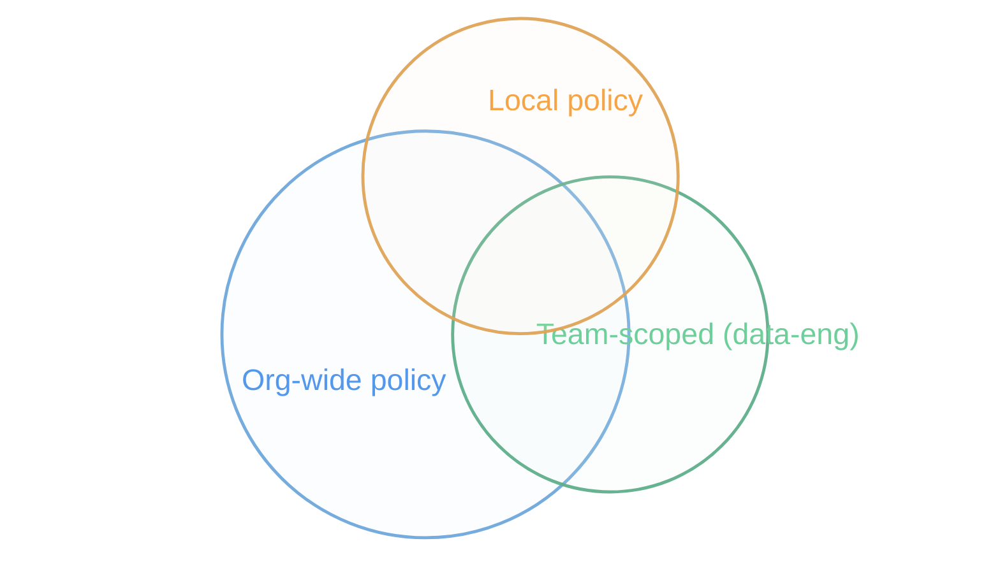
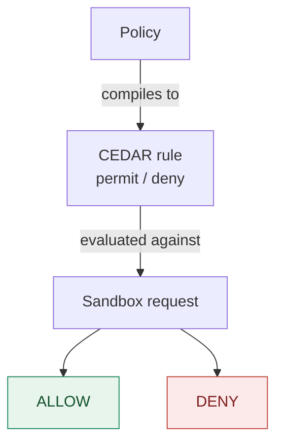

# Section 5 — Org Governance: Policies, Teams & Roles

**What this section covers, in order:**

- **Roles** — who's allowed to touch policy in the first place
- **Org** — the account-level boundary everything else here is scoped to
- **Policy** — the rule an org publishes, and how a developer confirms it's live
- **Local vs. Centrally Controlled** — how local defaults, kits, teams, and org policy all stack into one effective set of rules
- **CEDAR** — (Fine grained control)the language every one of those rules actually compiles down to, with a copy-pasteable example
- **Audit logging** *(closing note)* — how every decision, and every change to policy, stays attributable

## Why one laptop's rules aren't enough

In Section 4 the sandbox blocked `raw-tracker.example`, refused to read your SSH keys, and rejected an unapproved MCP server. Every one of those rules lived on **your machine**.

Ship that setup to 200 developers and you have 200 different security postures — and any one of them can run `sbx policy allow network` and loosen their own. Governance is what turns "rules I set up" into "rules my organization enforces."

---

## Roles

Before anything about policy, ask a simpler question: who's allowed to touch it? Docker's org roles:

| Role | Org admin access | Manage AI Governance policy |
|---|---|---|
| **Owner** | full — members, teams, settings, billing | ✅ by default |
| **Editor** | partial — repositories, team access | ❌ |
| **Member** | none — non-administrative | ❌ |
| **Custom role + Governance permission** | scoped to what you grant | ✅ delegated |

By default only **owners** can view and manage AI Governance policies. To let a security team manage them without handing over the whole organization, an owner creates a custom role carrying the **Governance** permission and assigns it to a team — **Docker Home → AI Platform → Roles**.

That team can now author network, filesystem, and MCP policies — and nothing else.

---

## Org

A Docker **organization** ("org") is the account-level container for your company: it holds members, teams, and — the reason it matters here — every governance setting that applies to all of them at once. Everything below is scoped to an org: `{{ state.configured_org }}` in this lab.

Roles, above, control who can act *within* an org. Policy, below, is *what* an org enforces. The org is simply the boundary all of it is drawn around — the difference between "rules I set up on my laptop" and "rules my organization enforces," as the intro to this section put it.

> **About the commands in this section**
> There is no CLI for managing org-level, team, or CEDAR policy — all of that happens in the **AI Governance portal** (Docker Home → AI Platform). The `sbx policy ...` commands below are the real CLI: they verify what's already in force from the developer's side; they don't create anything.

---

## Policy

A **policy** is a rule that decides whether a sandbox may reach a resource. Docker Sandboxes govern three resource types:

| Type | Governs | Example |
|---|---|---|
| **Network access** | outbound traffic from the sandbox | allow `github.com`, deny everything else |
| **Filesystem access** | which host paths may be mounted | the project workspace only |
| **MCP access** | which tool servers may register and run | approve `docker-hub-mcp`, block the rest |

One rule explains everything that follows:

> **Allows are additive. Denies are absolute.**
> Any matching allow grants access; any matching deny blocks it, no matter which policy it came from.

An org owner defines the baseline every sandbox inherits — a default-deny network posture with two approved destinations.

> **In the UI:** the policy is created at **Docker Home → AI Platform → Governance**. Pick a resource type (Network, Filesystem, or MCP), add allow and deny entries, set the scope to **Organization**, and publish.

No developer action required, and no developer can remove it. See it from your side, right now:

```bash terminal-id=host
sbx policy check network docker.io
```

`Allowed: docker.io:443` — and `Governance: Managed by dockerdemo` is the tell: this is the org baseline speaking, not anything local.

---

## Local vs. Centrally Controlled

Back on the developer's machine, list the active policies:

```bash terminal-id=host
sbx policy ls
```

That's a longer list than you might expect — `local` already ships with several pre-baked allow policies of its own (package registries, code hosts, cloud infra, OS packages, cert validation), before org governance even enters the picture. What's new here are the `org`-sourced rows near the bottom — `net-baseline`, `net-data-eng`, and a filesystem pair locking every sandbox to the workspace — and the output ends with **`Governance: Managed by dockerdemo`**: the sandbox is no longer taking orders from local configuration alone.

Want every rule each of those policies actually allows, not just the name?

```bash terminal-id=host
sbx policy ls --wide
```

Same rows, plus a `RESOURCES` column — every domain each policy actually allows, in full:

| Source | Applies to | Policy/rule | Type | Decision | Resources |
|---|---|---|---|---|---|
| local | all | `default-ai-services` | network | allow | `**.chatgpt.com:443`<br>`**.cursor.sh:443`<br>`**.factory.ai:443`<br>`**.oaistatic.com:443`<br>`**.oaiusercontent.com:443`<br>`**.openai.com:443`<br>`api.anthropic.com:443`<br>`api.perplexity.ai:443`<br>`api.workos.com:443`<br>`cdn.openaimerge.com:443`<br>`chatgpt.com:443`<br>`claude.com:443`<br>`cursor.com:443`<br>`downloads.claude.ai:443`<br>`factory.ai:443`<br>`gemini.google.com:443`<br>`generativelanguage.googleapis.com:443`<br>`mcp-proxy.anthropic.com:443`<br>`models.dev:443`<br>`platform.claude.com:443`<br>`play.googleapis.com:443`<br>`statsig.anthropic.com:443` |
| local | all | `default-package-managers` | network | allow | `**.bun.sh:443`<br>`**.gradle.org:443`<br>`**.packagist.org:443`<br>`**.yarnpkg.com:443`<br>`apache.org:443`<br>`astral.sh:443`<br>`bootstrap.pypa.io:443`<br>`bun.sh:443`<br>`cocoapods.org:443`<br>`cpan.org:443`<br>`crates.io:443`<br>`dot.net:443`<br>`dotnet.microsoft.com:443`<br>`eclipse.org:443`<br>`files.pythonhosted.org:443`<br>`golang.org:443`<br>`goproxy.io:443`<br>`gradle.org:443`<br>`haskell.org:443`<br>`hex.pm:443`<br>`index.crates.io:443`<br>`java.com:443`<br>`java.net:443`<br>`maven.org:443`<br>`metacpan.org:443`<br>`nodejs.org:443`<br>`nodesource.com:443`<br>`npm.duckdb.org:443`<br>`npmjs.com:443`<br>`npmjs.org:443`<br>`nuget.org:443`<br>`packagist.com:443`<br>`packagist.org:443`<br>`pkg.go.dev:443`<br>`proxy.golang.org:443`<br>`pub.dev:443`<br>`pypa.io:443`<br>`pypi.org:443`<br>`pypi.python.org:443`<br>`pythonhosted.org:443`<br>`registry.npmjs.org:443`<br>`repo.maven.apache.org:443`<br>`ruby-lang.org:443`<br>`rubygems.org:443`<br>`rubyonrails.org:443`<br>`rustup.rs:443`<br>`rvm.io:443`<br>`sh.rustup.rs:443`<br>`spring.io:443`<br>`static.crates.io:443`<br>`static.rust-lang.org:443`<br>`sum.golang.org:443`<br>`swift.org:443`<br>`tuf-repo-cdn.sigstore.dev:443`<br>`yarnpkg.com:443`<br>`ziglang.org:443` |
| local | all | `default-code-and-containers` | network | allow | `**.data.mcr.microsoft.com:443`<br>`**.docker.com:443`<br>`**.docker.io:443`<br>`**.gcr.io:443`<br>`**.github.com:443`<br>`**.githubcopilot.com:443`<br>`**.githubusercontent.com:443`<br>`**.gitlab.com:443`<br>`**.production.cloudflare.docker.com:443`<br>`**.production.cloudfront.docker.com:443`<br>`bitbucket.org:443`<br>`code.visualstudio.com:443`<br>`dhi.io:443`<br>`dhi.io:80`<br>`docker-images-prod.6aa30f8b08e16409b46e0173d6de2f56.r2.cloudflarestorage.com:443`<br>`docker.com:443`<br>`docker.io:443`<br>`gcr.io:443`<br>`ghcr.io:443`<br>`github.com:443`<br>`gitlab.com:443`<br>`k8s.io:443`<br>`launchpad.net:443`<br>`mcr.microsoft.com:443`<br>`ppa.launchpad.net:443`<br>`production.cloudflare.docker.com:443`<br>`production.cloudfront.docker.com:443`<br>`public.ecr.aws:443`<br>`quay.io:443`<br>`registry.k8s.io:443`<br>`sourceforge.net:443`<br>`vscode.dev:443`<br>`vscode.download.prss.microsoft.com:443` |
| local | all | `default-cloud-infrastructure` | network | allow | `**.amazonaws.com:443`<br>`**.blob.core.windows.net:443`<br>`**.googleapis.com:443`<br>`**.googleusercontent.com:443`<br>`**.gstatic.com:443`<br>`**.gvt1.com:443`<br>`**.hashicorp.com:443`<br>`**.public.blob.vercel-storage.com:443`<br>`**.visualstudio.com:443`<br>`apis.google.com:443`<br>`app.daytona.io:443`<br>`azure.com:443`<br>`binaries.prisma.sh:443`<br>`challenges.cloudflare.com:443`<br>`clerk.com:443`<br>`csp.withgoogle.com:443`<br>`dev.azure.com:443`<br>`dl.google.com:443`<br>`fastly.com:443`<br>`figma.com:443`<br>`hashicorp.com:443`<br>`jsdelivr.net:443`<br>`json-schema.org:443`<br>`json.schemastore.org:443`<br>`login.microsoftonline.com:443`<br>`mise-versions.jdx.dev:443`<br>`mise.run:443`<br>`packages.microsoft.com:443`<br>`play.google.com:443`<br>`playwright.azureedge.net:443`<br>`supabase.com:443`<br>`unpkg.com:443`<br>`vercel.com:443`<br>`visualstudio.com:443`<br>`www.google.com:443` |
| local | all | `default-os-packages` | network | allow | `**.debian.org:443`<br>`alpinelinux.org:443`<br>`apt.llvm.org:443`<br>`archive.ubuntu.com:443`<br>`archive.ubuntu.com:80`<br>`archlinux.org:443`<br>`centos.org:443`<br>`debian.org:443`<br>`dl-cdn.alpinelinux.org:443`<br>`fedoraproject.org:443`<br>`packagecloud.io:443`<br>`ports.ubuntu.com:443`<br>`ports.ubuntu.com:80`<br>`security.ubuntu.com:443`<br>`security.ubuntu.com:80`<br>`ubuntu.com:443` |
| local | all | `default-cert-validation` | network | allow | `**.amazontrust.com:443`<br>`**.amazontrust.com:80`<br>`**.lencr.org:443`<br>`**.lencr.org:80`<br>`**.pki.goog:443`<br>`**.pki.goog:80`<br>`**.pki.microsoft.com:443`<br>`**.pki.microsoft.com:80`<br>`*.one.au.digicert.com:80`<br>`*.one.ch.digicert.com:80`<br>`*.one.digicert.co.jp:80`<br>`*.one.digicert.com:80`<br>`*.one.nl.digicert.com:80`<br>`cacerts.digicert.com:80`<br>`crl*.digicert.com:80`<br>`crl.comodoca.com:80`<br>`crl.globalsign.com:80`<br>`crl.globalsign.net:80`<br>`crl.sectigo.com:80`<br>`crl.usertrust.com:80`<br>`crt.sectigo.com:80`<br>`isrg.trustid.ocsp.identrust.com:80`<br>`ocsp.comodoca.com:80`<br>`ocsp.digicert.com:80`<br>`ocsp.globalsign.com:443`<br>`ocsp.globalsign.com:80`<br>`ocsp.sectigo.com:80`<br>`ocsp.usertrust.com:80`<br>`ocsp2.globalsign.com:443`<br>`ocsp2.globalsign.com:80` |
| local | all | `default-fs-read-allow-all` | filesystem:read | allow | `**` |
| local | all | `default-fs-write-allow-all` | filesystem:write | allow | `**` |
| kit | `sandbox:AI-GOV-SimSpace-01-sep` | `kit:AI-GOV-SimSpace-01-sep` | network | allow | `claude.com:443`<br>`downloads.claude.ai:443`<br>`mcp-proxy.anthropic.com:443` |
| kit | `sandbox:shell-floci` | `kit:shell-floci` | network | allow | `openrouter.ai` |
| org | organization | `net-baseline` | network | allow | `github.com:443`<br>`docker.io:443` |
| org | team:data-eng | `net-data-eng` | network | allow | `huggingface.co:443` |
| org | organization | `org-workspace-read` | filesystem:read | allow | `/home/agent/workspace` |
| org | organization | `org-workspace-write` | filesystem:write | allow | `/home/agent/workspace` |

Four rows here are things an org owner actually published: `net-baseline` (organization-wide network), `net-data-eng` (scoped to just the data-eng team — more on that below), and a filesystem pair — `org-workspace-read` / `org-workspace-write` — locking every sandbox to the project workspace, the same restriction the resource-type table earlier in this section described. Everything else in this table was already there, shipped by the platform (`local`) or by a kit (Section 6). Reachability is the union of every row.

Check a destination that isn't on the allowlist:

```bash terminal-id=host
sbx policy check network pastebin.com
```

`Denied: pastebin.com:443` — and `Governance: Managed by dockerdemo` again confirms it's the org baseline blocking this, not anything local.

> Under org governance, only organization allow rules grant access. A developer can still add a local **deny** to restrict themselves further — they can never loosen what the org permits.

Not every team needs the same access, either — that `net-data-eng` row you just saw is exactly this in practice. The data engineering team needs Hugging Face; the frontend team does not. Rather than widening the org-wide baseline for everyone, an org owner scopes a policy to just that team, in the same portal screen — same as the baseline above, but with scope set to **Team: data-eng** and `huggingface.co` added to the allow list.

A sandbox is governed by the **union** of every policy that applies to it — org-wide, team-scoped, and whatever's still local to that machine:



> **effective policy = every org-wide policy + every team-scoped policy for the teams they belong to + whatever's still local**

Everyone sits inside **Org**. Only data engineers also sit inside **Team**. Anyone can still add their own **Local** rules — but per the rule above, a local rule can only shrink what they're allowed, never grow it, since denies are absolute and only *organization* allow rules grant access under governance.

So a data engineer gets `github.com`, `docker.io` *and* `huggingface.co`. Everyone else still gets just the baseline two. Teams come from your existing org structure — created by hand in Docker Home, or synchronized automatically from your identity provider's groups.

You're not on the data-eng team, so check what that means for you:

```bash terminal-id=host
sbx policy check network huggingface.co
```

`Denied: huggingface.co:443` — it isn't covered by any policy that applies to you (the CLI's `Reason` line doesn't name teams, so this is where knowing *why* matters: `huggingface.co` only lives on `net-data-eng`, and you're not on that team). A data engineer running this exact command would see `Allowed`; you'd still get `github.com` and `docker.io` either way, since the org-wide policy applies to everyone.

---

## Fine-Grained Control: CEDAR

Every rule above — the allow list, the deny list, the additive/absolute logic, the union of org/team/local — is expressed in **CEDAR**, an open-source policy language designed for exactly this: access rules that are explicit, auditable, and machine-checked instead of buried in application code. The AI Governance portal is a UI on top of CEDAR — every dropdown and rule builder you've used above is generating CEDAR for you.

Here's the shape of it:



Every policy compiles down to a `permit` or `deny` statement, matched against the action and resource a sandbox is trying to reach. The org baseline from earlier — allow `github.com`, `docker.io`; deny everything else — is, in full, this:

```js filename="policy.cedar" no-run-button
permit(
  action == Net::Egress,
  resource in { host("github.com"), host("docker.io") }
);

deny(
  action == Net::Egress,
  resource == "*"
);
```

That isn't illustrative pseudo-syntax — paste it as-is into the AI Governance portal's policy editor and you'd reproduce the exact baseline above.

> **Reference**
> - CEDAR language docs: [cedarpolicy.org](https://www.cedarpolicy.org/)
> - Docker AI Governance portal: [Docker Home → AI Platform](https://app.docker.com/)

---

## Who did what: audit logging

Governance without an audit trail is just a suggestion. From a sandbox, `sbx policy log` shows exactly what got blocked or allowed in that session — you saw this in Section 4. At the org level, that same trail rolls up into the **org's Docker Hub audit dashboard**: every policy decision, and every change to policy itself, attributable to whoever made it. That's what makes the **Owner** / **Custom + Governance** roles at the top of this section actually accountable, not just a permissions list.

---

## Summary

| What we demonstrated | How |
|---|---|
| Authorship is itself governed | Custom role with the **Governance** permission |
| Everything is scoped to an org | `{{ state.configured_org }}`, managed at Docker Home → AI Platform |
| Policies are published in the portal, not per-laptop | Docker Home → AI Platform → Governance |
| Org rules beat local ones; access can differ by team | `sbx policy check network docker.io` / `huggingface.co` |
| Every rule is CEDAR underneath | copy-pasteable `policy.cedar` above |
| Every decision is auditable | `sbx policy log` + the org's Docker Hub audit dashboard |

Roles decide *who may change the answer*. An org is the boundary it's all scoped to. Policies decide *what* a sandbox may do — as a union of org-wide, team-scoped, and local rules — and CEDAR is what actually runs that decision underneath.

> [Continue to Section 6 → SBX Kits](#/6-sbx-kits) to learn how to package a governed environment — tools, policy profile, and workspace — into one distributable artifact.
