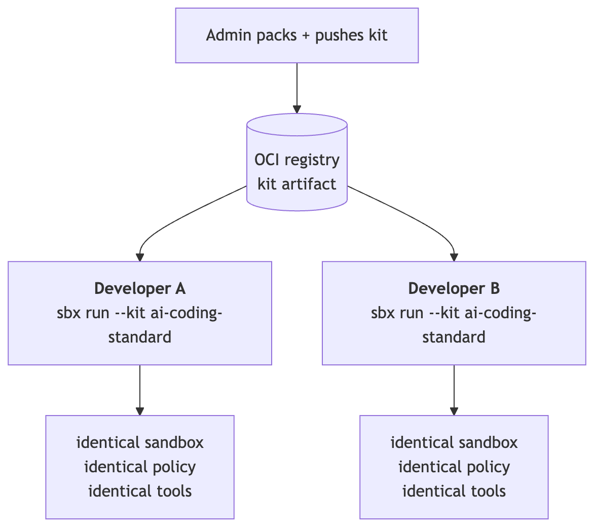
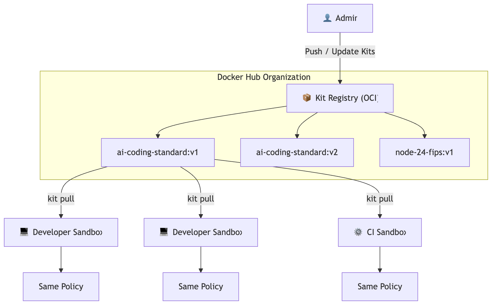

# Section 6 — SBX Kits

## What is an SBX Kit?

An **SBX Kit** is a declarative YAML artifact (`spec.yaml` + a `files/` directory)
that extends a sandbox with four things in one package:

| Layer | What it fixes |
|---|---|
| **Base image / tools** | Pre-installed CLIs, runtimes, MCP servers — no ad-hoc `apt install` during sessions |
| **Credentials** | Service secrets the sandbox needs, provisioned automatically |
| **Policy profile** | Network allowlist, filesystem rules, MCP gateway config — identical enforcement for everyone |
| **Workspace seed / startup commands** | Starter files, `.env` scaffold, `CLAUDE.md` agent instructions, commands to run on boot |

A kit is published once by an admin and consumed by the team. Every developer
who runs `sbx run --kit ai-coding-standard claude` gets an identical,
policy-correct environment — no drift, no manual setup.




---

## Why Kits Matter for AI Governance

Without kits, sandbox drift is inevitable:

- Developer A has `github.com` allowed; Developer B forgot and added `*` (all domains)
- MCP server allowlists vary per machine
- Tool versions differ, causing reproducibility failures
- No standard audit baseline across the team

With kits:

- **One kit reference = one policy config** — network rules, MCP allowlists, and filesystem restrictions are locked in the kit's `spec.yaml`
- **Kit updates propagate** — push a new version tag to enforce updated policies org-wide
- **Every push is signed and attested** — `sbx kit push` attaches an SLSA provenance attestation automatically, with optional cryptographic signing

Docker also ships a handful of built-in kits your org can start from:

| Kit | Base | Key tools | Policy profile |
|---|---|---|---|
| `ai-coding-standard` | `dhi.io/ubuntu:22.04-hardened` | claude-code, git, docker-scout, gh | org-default |
| `node-24-fips` | `dhi.io/node:24-alpine3.22` | node 24, npm, docker | fips-strict |
| `python-3.12-hardened` | `dhi.io/python:3.12-slim` | python 3.12, pip, uv | org-default |
| `java-21-graalvm` | `dhi.io/eclipse-temurin:21` | java 21, maven, gradle | org-default |

There's no `sbx kit ls` — kits are OCI artifacts, referenced by name or
registry path just like any image, not browsed from a registry index. Start
by inspecting one you already know about:

---

## Step 1: Inspect a kit before pulling

```bash terminal-id=host
sbx kit inspect ai-coding-standard
```

The inspect output shows:

- **Base image** with CVE posture (0 critical for any DHI-based kit)
- **Pre-installed tools** and their versions — reproducible across every session
- **Policy profile** — the exact network/filesystem/MCP rules that will be enforced
- **Workspace seed** — files pre-seeded into `/home/agent/workspace`

> The policy profile is what governs Claude Code's actions. Admins can customize this — for example, adding `pypi.org` to the network allowlist for Python-focused kits, or restricting the MCP gateway to a subset of approved servers.

---

## Step 2: Pull the kit

```bash terminal-id=host
sbx kit pull ai-coding-standard
```

The kit artifact is pulled from the OCI registry, verified, and cached
locally as a file. The base image (`dhi.io/ubuntu:22.04-hardened`) is
validated for FIPS compliance at pull time.

> Every `sbx kit push` (Step 5) attaches an SLSA provenance attestation, and can be cryptographically signed (keyless via Fulcio/Rekor, or with a key). A tampered kit fails verification before it's ever applied to a sandbox.

---

## Step 3: Start a sandbox from the kit

Kits are applied with the `--kit` flag on `sbx run` — there's no separate `kit start` subcommand. Switch to the **Sandbox** tab (top right), then run:

```bash terminal-id=sandbox
sbx run --kit ai-coding-standard claude
```

Compare this to a plain `sbx run`:

| `sbx run claude` | `sbx run --kit ai-coding-standard claude` |
|---|---|
| Bare microVM | Bare microVM **+ pre-installed tools** |
| You configure policies | **Kit's policy profile auto-applied** |
| Empty workspace | **Workspace seed pre-loaded** |
| You install claude, git, docker | **Already present and versioned** |

The sandbox is ready immediately, with Claude Code already running — no setup steps, no tool installation, no policy configuration. Prove it by asking Claude directly, instead of taking the kit's word for it:

```prompt terminal-id=sandbox
What tools do you have available, and what's already in my workspace?
```

Claude lists the pre-installed tools (`claude-code`, `git`, `docker`, `docker-scout`, `gh`) and the pre-seeded workspace files (`.claude/CLAUDE.md`, `.env.template`, `README.md`) — none of it set up by hand, all of it from the kit.

When you're done, leave the session and head back to the Terminal tab for the rest of this section:

```prompt terminal-id=sandbox
/exit
```

Switch back to the **Terminal** tab (top right).

---

## Step 4: Author and pack your own kit

A kit is authored as a local directory — `spec.yaml` declaring credentials,
network policy, environment variables, startup commands, plus a `files/`
subdirectory for workspace seed content:

```bash terminal-id=host
ls ./ai-coding-standard/
```

```bash terminal-id=host
cat ./ai-coding-standard/spec.yaml
```

Credentials are declared by **name and type only** — `github: token`, injected as `GITHUB_TOKEN`. The kit never stores or ships an actual secret value; the real value is injected by the credential proxy at runtime (Section 4, Step 3).

The `files/` directory is what gets seeded into every sandbox's workspace, so keep it free of anything sensitive — no tokens, no passwords, no filled-in `.env` values:

```bash terminal-id=host
ls ./ai-coding-standard/files/
```

```bash terminal-id=host
cat ./ai-coding-standard/files/.env.template
```

```bash terminal-id=host
cat ./ai-coding-standard/files/.claude/CLAUDE.md
```

`.env.template` only ever ships variable *names*, never values. `CLAUDE.md` even tells the agent explicitly not to read or print `.env`, SSH keys, or anything under `/etc` — the same boundary Step 4 of Section 4 proved is enforced for real.

Once your `./ai-coding-standard/` directory is ready, package it:

```bash terminal-id=host
sbx kit pack ./ai-coding-standard/
```

The pack process:

1. Validates `spec.yaml` against the kit schema
2. Bundles the `files/` workspace seed
3. Produces a portable kit artifact ready to push

> **Workspace seeding tip**: put reusable files under `files/` before packing. A `CLAUDE.md` with project-specific instructions is especially useful — Claude Code reads it automatically at startup.

---

## Step 5: Push the kit to your org

Share the kit with your team — `sbx kit push` takes both the source directory and the destination reference:

```bash terminal-id=host
sbx kit push ./ai-coding-standard $$org$$/ai-coding-standard:v1 --sign
```

Once pushed:

- All members of `$$org$$` can `sbx kit pull $$org$$/ai-coding-standard:v1`
- Or run it directly: `sbx run --kit $$org$$/ai-coding-standard:v1 claude`
- Audit trail: kit push and every sandbox run that applies it are logged to the org audit stream

> **Versioning**: tag kits semantically (`v1`, `v1.1`, `v2`). When you update a policy (e.g. to add a new MCP server to the allowlist), push a new tag. The old tag remains available for rollback.

---

## Bonus: attach a kit to an already-running sandbox

Kits aren't only a start-time concept — `sbx kit add` attaches one to a
sandbox that's already running, without losing agent session state:

```bash terminal-id=host
sbx kit add sbx-claude-kit-7f3a $$org$$/ai-coding-standard:v1
```

The sandbox's container is recreated with the kit appended to its kit list;
kit-owned volumes (like agent session state) are preserved across the swap.

---

## Kit governance in the org



Admins manage kits at:  
**Hub → `$$org$$` → Docker Scout → Sandboxes → Kits**

---

## Summary

| Capability | Command |
|---|---|
| Inspect a kit | `sbx kit inspect <reference>` |
| Pull a kit | `sbx kit pull <reference>` |
| Start a sandbox from a kit | `sbx run --kit <reference> <agent>` |
| Pack a kit from a local directory | `sbx kit pack <directory>` |
| Push a kit to your org | `sbx kit push <directory> <reference> --sign` |
| Attach a kit to a running sandbox | `sbx kit add <sandbox> <reference>` |

---

> **At any point, type `demo reset` in either terminal to restore the lab to its initial state — all section progress is cleared and you can start fresh from Section 2.**
